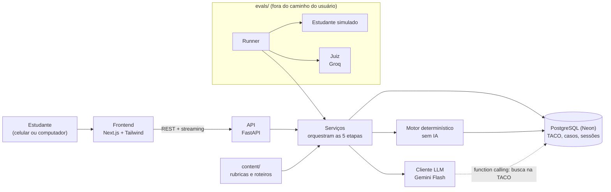

# Arquitetura do NutriSim

## Princípio

**A IA representa o comportamento do paciente, e o motor determinístico calcula a fisiologia.**

Modelos de linguagem conversam bem, mas produzem números plausíveis e inventados quando a tarefa é "simular o resultado de uma dieta". Por isso o LLM fica restrito ao que o paciente diria, faria ou omitiria. Composição dos alimentos, gasto energético, adequação e projeção de peso vêm da TACO e de equações publicadas. Essa separação reduz o risco de alucinação e torna o cálculo testável. As justificativas estão em [ADR-001](decisoes.md).

## Componentes



## Etapas × componentes

A tabela abaixo espelha as raias da [Figura 1 do relatório](relatorios/fluxo.png).

| Etapa | Estudante | IA (LLM) | Motor determinístico | Resultado |
|---|---|---|---|---|
| 1. Caso | escolhe perfil e dificuldade | gera a ficha oculta (JSON validado) | – | caso criado; a ficha fica só no backend |
| 2. Anamnese | conduz a entrevista em tempo real | interpreta o paciente a partir da ficha | – | histórico da conversa |
| 3. Plano alimentar | monta o plano com busca na TACO | – | calcula nutrientes e GET e confere as restrições | plano com composição e alertas |
| 4. Cenários | – | define a adesão realista (JSON) e as substituições | projeta peso e adequação: ideal × real | gráficos por cenário |
| 5. Retorno e feedback | recebe resultados e feedback | conduz o retorno e corrige pela rubrica | – | feedback com pontos fortes e lacunas |

## Regras de fronteira

Estas regras valem para todo o código. O revisor de PR confere cada uma delas.

1. **O motor não chama o LLM**, e o LLM **nunca produz números fisiológicos** (energia, nutrientes, GET, peso).
2. **A IA só escolhe alimentos que existem na TACO**, via *function calling*. Quem calcula o efeito desses alimentos é o motor.
3. **O prompt do paciente contém apenas o que o paciente conhece.** O gabarito da avaliação fica em outra chamada, de modo que uma injeção de prompt bem-sucedida não revela a correção.
4. **Toda saída estruturada do LLM passa pelo Pydantic.** Uma resposta inválida gera nova tentativa automática.
5. **A ficha oculta nunca vai para o frontend.**
6. **As chaves de API ficam só no backend**, e o modelo é definido por variável de ambiente.
7. **Doenças entram só como restrições verificáveis** (por exemplo, limite de sódio), nunca como desfechos simulados.
8. **Toda projeção aparece com a limitação do modelo** ao lado.

## Chamadas ao LLM

O LLM é usado em cinco tarefas, cada uma com seu próprio prompt versionado em `backend/app/llm/prompts/`:

| Tarefa | Entrada | Saída | Controle | Card |
|---|---|---|---|---|
| Geração de caso | perfil e dificuldade | ficha oculta (JSON) | schema Pydantic | NS-019 |
| Paciente simulado | ficha sem gabarito + histórico | texto em streaming | eval de consistência e robustez | NS-020 |
| Adesão realista | plano e perfil | adesão por refeição + substituições (JSON), com ferramenta de busca na TACO | schema + regras de coerência | NS-046 |
| Consulta de retorno | ficha + cenário realista | texto | eval de consistência | NS-050 |
| Avaliação por rubrica | transcrição + gabarito + trechos de `content/` | notas por critério, pontos fortes e lacunas (JSON) | schema + kappa com o professor | NS-051 |

A recuperação de contexto da rubrica é feita por filtro de metadados, sem banco vetorial ([ADR-004](decisoes.md)).

## Árvore de pastas

A estrutura de primeiro nível segue a seção 6.3 do relatório. As subpastas são criadas junto com o primeiro arquivo real, no card indicado. O README de cada pasta detalha a estrutura interna.

```text
nutrisim/
├── backend/                     README: ../backend/README.md
│   ├── app/
│   │   ├── api/                 rotas REST por etapa                            NS-007/008
│   │   ├── schemas/             Pydantic: contrato da API e ficha oculta        NS-014
│   │   ├── db/                  modelos e migrações (Alembic)                   NS-012
│   │   ├── llm/                 cliente, validação, ferramentas, tokens         NS-018
│   │   │   └── prompts/         prompts versionados do produto                  NS-019+
│   │   ├── motor/               cálculo determinístico, sem IA                  NS-023+
│   │   └── services/            orquestração das 5 etapas
│   ├── data/taco/               TACO original + importação                      NS-013
│   └── tests/{unit,integration}/                                                NS-029/030
├── frontend/                    README: ../frontend/README.md
│   ├── src/{app,components,lib}/                                                NS-009+
│   └── e2e/                     Playwright (360 px e desktop)                   NS-060
├── content/{rubricas,roteiros}/ material revisado pelo curso de Nutrição       NS-049
├── evals/{fichas,ataques,juiz,scripts,resultados}/                              NS-017+
├── docs/
│   ├── relatorios/              relatórios dos checkpoints
│   └── prompts/                 registro de uso de IA no desenvolvimento
└── .github/                     templates; workflows de CI                      NS-011
```

Os nomes seguem esta convenção: camadas técnicas em inglês (`api`, `db`, `llm`, `services`) e domínio em português (`motor`, `rubricas`, `roteiros`), com o mesmo vocabulário do relatório.

### Duas pastas de "prompts"

| Pasta | O que guarda | Por quê |
|---|---|---|
| `backend/app/llm/prompts/` | os prompts **que o NutriSim usa** para gerar casos, simular o paciente etc. | são parte do produto; o eval registra a versão de cada um |
| `docs/prompts/` | os prompts **que a equipe usou para desenvolver** o projeto com ajuda de IA | exigência de integridade acadêmica do edital |

## Contrato da API

O contrato entre frontend e backend (endpoints, schemas e formato do streaming) é definido no card NS-007, no arquivo `docs/api.md`. O frontend pode desenvolver contra um mock desse contrato antes de o backend ficar pronto.

## Limitações conhecidas

- **Projeção de peso:** usa a versão simplificada do modelo de Hall et al. (2011), adequada a poucas semanas. A limitação aparece na interface.
- **Custo e limites:** o plano gratuito do Gemini limita requisições por minuto e por dia. Por isso há registro de tokens por chamada, cache de respostas e evals em lotes.
- **Hibernação no Render gratuito:** o serviço dorme após um período sem uso, e a primeira requisição depois disso é lenta. Esse atraso precisa ser medido em relação à meta de 3 s para o início da resposta (NS-058).
- **Preços dos alimentos:** a TACO não traz preço, e a restrição de orçamento depende de uma tabela própria de preços aproximados (NS-043).
