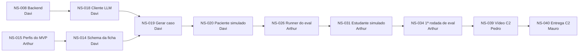
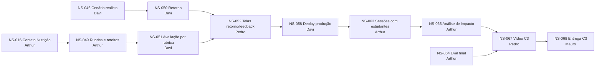

# Caminho crítico

O caminho crítico é a sequência de cards em que **um dia de atraso vira um dia de atraso na entrega**. Ele sai do campo "Depende de" dos cards do [`kanban.md`](kanban.md) e define a prioridade de cada um. As cargas usam P = 0,5, M = 1,5 e G = 3 dias.

## Prioridades

| Prioridade | Regra | Na prática |
|---|---|---|
| **P0** | está no caminho crítico da C2 ou da C3 | começa primeiro; bloqueio vira assunto do grupo no mesmo dia |
| **P1** | bloqueia outro card, mas tem folga | termina antes de quem depende dele entrar na sprint |
| **P2** | não bloqueia nenhum card | pode escorregar dentro da sprint |
| **P3** | desejável (backlog) | só entra com folga |

## Caminho até a C2 (30/10)

- A cadeia soma **~14 dias úteis**, e a sprint 1 começou em 21/09. Há folga no papel, mas **Davi faz cinco cards seguidos** (NS-008, NS-014, NS-018, NS-019 e NS-020, ~9 dias): é o gargalo da C2.
- **NS-015 é o card mais urgente agora.** Ele passou do Pedro para o Arthur com a troca de papéis e trava o schema da ficha (NS-014), que trava todo o resto.
- Entram na cadeia pelo lado, com folga: NS-017 → NS-032 → NS-033 (juiz validado), NS-027 e NS-028 (fichas e ataques) e NS-011 → NS-038 (preview). Se o juiz ficar abaixo de 85% (NS-033), a NS-034 atrasa: façam a rotulagem cedo.
- O frontend (NS-007 → NS-021/NS-022 → NS-037) não está no caminho crítico, porque o vídeo pode mostrar o fluxo com o mock do contrato. Ainda assim, o contrato (NS-007) precisa sair na sprint 1.

## Caminho até a C3 (04/12)

- As sessões (NS-063) têm **data fixa na sprint 6** e dependem da agenda do curso. Tudo o que vem antes delas precisa estar pronto até 23/11; tudo o que vem depois cabe em uma semana.
- **Davi é de novo o gargalo:** NS-041, NS-046, NS-050 e NS-051 somam ~9 dias entre as sprints 4 e 5. Se a sprint 4 atrasar, a NS-041 (endpoints do plano, que só expõem o motor) pode passar para o Mauro.
- **Arthur depende de terceiros:** o professor de Nutrição valida a rubrica (NS-049) e os cenários (NS-056). Por isso o contato (NS-016) é P0, mesmo sendo da sprint 1.
- A eval final (NS-064) junta NS-034, NS-047 e NS-056 e precisa terminar antes do vídeo da C3.

## Impacto de cada card

**Bloqueia** lista os cards que só começam quando este terminar. **Cadeia** conta todos os cards afetados em cascata. **Checkpoint** diz qual entrega (C1, C2 ou C3) atrasa se a cadeia inteira atrasar.

| Card | Prioridade | Sprint | Dono | Bloqueia | Cadeia | Checkpoint |
|---|---|---|---|---|---|---|
| NS-001 | P0 | S0 | Davi | NS-002, NS-003 | 3 | C1 |
| NS-002 | P2 | S0 | Davi | – | 0 | – |
| NS-003 | P0 | S0 | Mauro | NS-006 | 1 | C1 |
| NS-004 | P0 | S0 | Arthur | NS-006 | 1 | C1 |
| NS-005 | P2 | S0 | Pedro | – | 0 | – |
| NS-006 | P0 | S0 | Mauro | – | 0 | C1 |
| NS-007 | P1 | S1 | Davi | NS-021, NS-022 | 3 | – |
| NS-008 | P0 | S1 | Davi | NS-011, NS-012, NS-018 | 30 | C2, C3 |
| NS-009 | P1 | S1 | Pedro | NS-011, NS-021 | 11 | C2, C3 |
| NS-010 | P1 | S1 | Pedro | NS-021, NS-022 | 3 | – |
| NS-011 | P1 | S1 | Mauro | NS-038 | 8 | C2, C3 |
| NS-012 | P1 | S1 | Mauro | NS-013 | 18 | C3 |
| NS-013 | P1 | S1 | Mauro | NS-023, NS-046 | 17 | C3 |
| NS-014 | P0 | S1 | Davi | NS-019, NS-027 | 12 | C2, C3 |
| NS-015 | P0 | S1 | Arthur | NS-014 | 13 | C2, C3 |
| NS-016 | P0 | S1 | Arthur | NS-049 | 14 | C3 |
| NS-017 | P1 | S1 | Arthur | NS-026, NS-027, NS-032 | 11 | C2, C3 |
| NS-018 | P0 | S2 | Davi | NS-019, NS-046 | 20 | C2, C3 |
| NS-019 | P0 | S2 | Davi | NS-020, NS-030 | 10 | C2, C3 |
| NS-020 | P0 | S2 | Davi | NS-026, NS-030 | 9 | C2, C3 |
| NS-021 | P1 | S2 | Pedro | NS-037 | 1 | – |
| NS-022 | P1 | S2 | Pedro | NS-037 | 1 | – |
| NS-023 | P1 | S2 | Mauro | NS-025, NS-029, NS-041 | 4 | – |
| NS-024 | P1 | S2 | Mauro | NS-029, NS-045 | 4 | – |
| NS-025 | P1 | S2 | Mauro | NS-029 | 1 | – |
| NS-026 | P0 | S2 | Arthur | NS-031 | 7 | C2, C3 |
| NS-027 | P1 | S2 | Arthur | NS-034 | 6 | C2, C3 |
| NS-028 | P1 | S2 | Arthur | NS-034 | 6 | C2, C3 |
| NS-029 | P2 | S3 | Mauro | – | 0 | – |
| NS-030 | P2 | S3 | Mauro | – | 0 | – |
| NS-031 | P0 | S3 | Arthur | NS-034 | 6 | C2, C3 |
| NS-032 | P1 | S3 | Arthur | NS-033 | 7 | C2, C3 |
| NS-033 | P1 | S3 | Arthur | NS-034 | 6 | C2, C3 |
| NS-034 | P0 | S3 | Arthur | NS-039, NS-064 | 5 | C2, C3 |
| NS-035 | P1 | S3 | Davi | NS-036, NS-053 | 4 | – |
| NS-036 | P2 | S3 | Pedro | – | 0 | – |
| NS-037 | P2 | S3 | Pedro | – | 0 | – |
| NS-038 | P1 | S3 | Davi | NS-039, NS-058 | 7 | C2, C3 |
| NS-039 | P0 | S3 | Pedro | NS-040 | 1 | C2 |
| NS-040 | P0 | S3 | Mauro | – | 0 | C2 |
| NS-041 | P1 | S4 | Davi | NS-042 | 1 | – |
| NS-042 | P2 | S4 | Pedro | – | 0 | – |
| NS-043 | P1 | S4 | Mauro | NS-044 | 3 | – |
| NS-044 | P1 | S4 | Mauro | NS-042, NS-055 | 2 | – |
| NS-045 | P1 | S4 | Mauro | NS-048, NS-055 | 2 | – |
| NS-046 | P0 | S4 | Davi | NS-047, NS-048, NS-050 | 11 | C3 |
| NS-047 | P1 | S4 | Arthur | NS-064 | 3 | C3 |
| NS-048 | P2 | S4 | Pedro | – | 0 | – |
| NS-049 | P0 | S4 | Arthur | NS-051 | 13 | C3 |
| NS-050 | P0 | S5 | Davi | NS-052 | 7 | C3 |
| NS-051 | P0 | S5 | Davi | NS-052, NS-053, NS-056 | 12 | C3 |
| NS-052 | P0 | S5 | Pedro | NS-058, NS-060 | 6 | C3 |
| NS-053 | P1 | S5 | Mauro | NS-054, NS-069 | 2 | – |
| NS-054 | P2 | S5 | Pedro | – | 0 | – |
| NS-055 | P2 | S5 | Mauro | – | 0 | – |
| NS-056 | P1 | S5 | Arthur | NS-064 | 3 | C3 |
| NS-057 | P1 | S5 | Arthur | NS-059, NS-062 | 6 | C3 |
| NS-058 | P0 | S6 | Davi | NS-063, NS-067 | 4 | C3 |
| NS-059 | P2 | S6 | Davi | – | 0 | – |
| NS-060 | P2 | S6 | Mauro | – | 0 | – |
| NS-061 | P2 | S6 | Pedro | – | 0 | – |
| NS-062 | P1 | S6 | Arthur | NS-063 | 4 | C3 |
| NS-063 | P0 | S6 | Arthur | NS-065 | 3 | C3 |
| NS-064 | P0 | S7 | Arthur | NS-067, NS-068 | 2 | C3 |
| NS-065 | P0 | S7 | Arthur | NS-067, NS-068 | 2 | C3 |
| NS-066 | P1 | S7 | Mauro | NS-068 | 1 | C3 |
| NS-067 | P0 | S7 | Pedro | NS-068 | 1 | C3 |
| NS-068 | P0 | S7 | Mauro | – | 0 | C3 |
| NS-069 | P3 | – | Pedro | – | 0 | – |

Quando um card mudar de dependência no `kanban.md`, atualizem o "Bloqueia" dos cards envolvidos e esta tabela na mesma PR.
