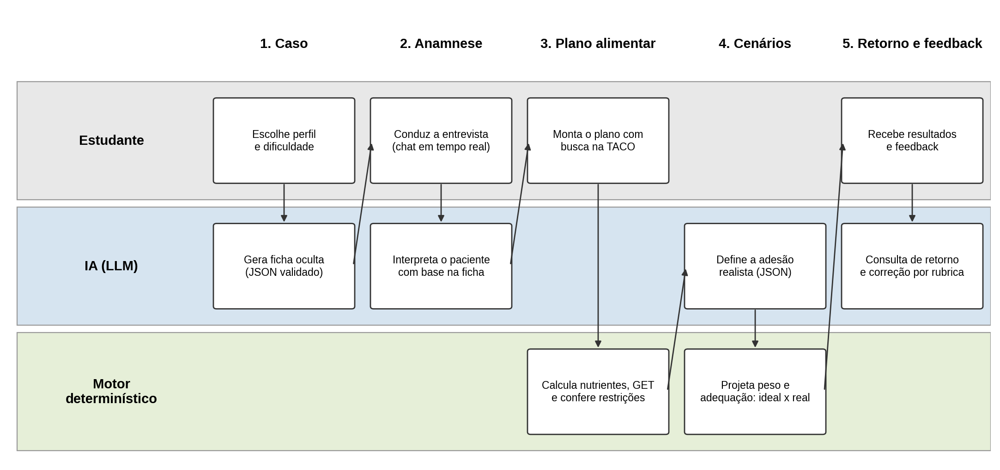

# NutriSim: simulador de pacientes com inteligência artificial para o ensino de Nutrição

**Relatório técnico – Checkpoint 1 (C1)**
Projeto Integrador IV – Aplicações de Inteligência Artificial
Centro Universitário FAESA – Curso de Ciência da Computação
Professor: Prof. M.Sc. Howard Cruz Roatti
Vitória, 2026

**Autores:** Arthur Pomarolli, Davi de Souza, Mauro Barros, Pedro Augusto

> Trechos marcados com `==destaque==` ainda precisam ser preenchidos.

## Resumo

Este relatório apresenta o escopo, a justificativa, a metodologia e o plano de trabalho do NutriSim, aplicação web responsiva, acessível por computador e dispositivos móveis, que utiliza inteligência artificial para simular pacientes em consultas nutricionais. O estudante de Nutrição escolhe o perfil e o nível de dificuldade do caso, conduz a anamnese em uma conversa em tempo real com um paciente simulado por modelo de linguagem, elabora um plano alimentar e observa como esse plano se comportaria em um cenário de adesão ideal e em um cenário de adesão realista. A solução separa deliberadamente as responsabilidades: o modelo de linguagem representa o comportamento do paciente, enquanto um motor de cálculo determinístico, baseado na Tabela Brasileira de Composição de Alimentos e em equações publicadas, calcula a composição nutricional, a necessidade energética e a projeção de peso. Essa separação reduz o risco de alucinações e torna o sistema testável. O projeto prevê testes automatizados, um harness de avaliação do componente de IA com metas de consistência, robustez e concordância com especialistas, práticas de IA responsável e indicadores de impacto junto a estudantes do curso de Nutrição do Centro Universitário FAESA.

**Palavras-chave:** inteligência artificial; ensino de nutrição; simulação clínica; modelos de linguagem; avaliação de IA.

## 1 Introdução

### 1.1 Contextualização

A formação do nutricionista exige competências que vão além do domínio teórico sobre a composição dos alimentos e as recomendações nutricionais. Na prática clínica, o profissional precisa conduzir uma anamnese alimentar capaz de revelar hábitos, rotina, preferências e limitações do paciente e, a partir dela, elaborar um plano alimentar que seja adequado do ponto de vista nutricional e, ao mesmo tempo, exequível na vida real. Grande parte dessas habilidades é desenvolvida nos estágios supervisionados e nos atendimentos em clínicas-escola, quando o estudante já lida com pacientes reais.

A simulação é uma estratégia consolidada no ensino em saúde para que o estudante pratique em ambiente seguro antes do contato com pacientes. O uso de pacientes padronizados, interpretados por pessoas treinadas, conta com padrões internacionais de boas práticas (LEWIS et al., 2017), mas depende de preparação, disponibilidade de pessoas e custo, o que limita a frequência com que cada estudante consegue praticar.

Os modelos de linguagem de grande escala (*Large Language Models* – LLMs) tornaram possível simular pacientes em conversas em tempo real, com baixo custo e disponibilidade contínua. Esses modelos, porém, podem produzir informações falsas com aparência plausível, fenômeno conhecido como alucinação, o que exige cuidado especial em um contexto de formação em saúde. Este projeto, desenvolvido no âmbito do Projeto Integrador IV (ROATTI, 2026), propõe uma solução que aproveita a capacidade conversacional dos LLMs sem delegar a eles conclusões fisiológicas que não conseguem garantir.

### 1.2 Problema

Como oferecer aos estudantes de Nutrição oportunidades frequentes, seguras e avaliáveis de praticar a anamnese alimentar e a elaboração de planos alimentares realistas, sem depender de pacientes reais ou de atores e sem que a ferramenta transmita conteúdos incorretos?

### 1.3 Objetivo geral

Desenvolver, testar e publicar o NutriSim, aplicação web responsiva, acessível por computador e dispositivos móveis, que utiliza inteligência artificial para simular pacientes em consultas nutricionais, permitindo ao estudante conduzir a anamnese, prescrever um plano alimentar e observar o comportamento desse plano diante de diferentes níveis de adesão.

### 1.4 Objetivos específicos

São objetivos específicos do projeto:

a) implementar um paciente simulado, baseado em LLM, que responda de forma consistente a uma ficha clínica oculta gerada a partir do perfil e da dificuldade escolhidos pelo estudante;

b) desenvolver um motor de cálculo determinístico para composição nutricional, estimativa de necessidade energética e projeção de peso, a partir de tabelas e equações publicadas;

c) simular cenários de adesão ao plano alimentar, separando o comportamento do paciente, gerado pela IA, dos desfechos calculados pelo motor;

d) oferecer feedback ao estudante por meio de rubrica de avaliação da consulta;

e) construir testes automatizados e um harness de avaliação (*eval*) que meça consistência, robustez e qualidade das saídas de IA;

f) aplicar práticas de IA responsável relacionadas à privacidade, à segurança, à ética e ao custo de uso;

g) avaliar o impacto da ferramenta junto a estudantes de Nutrição por meio dos indicadores definidos neste relatório.

### 1.5 Justificativa

O projeto se justifica, em primeiro lugar, pela necessidade de prática. Uma ferramenta disponível a qualquer hora, no computador ou no celular, permite que o estudante repita consultas com perfis variados antes de atender pacientes reais, complementando as atividades presenciais do curso.

Em segundo lugar, pelo realismo. Pacientes frequentemente subnotificam ou relatam de forma imprecisa o que consomem em recordatórios e registros alimentares (POSLUSNA et al., 2009), e planos tecnicamente corretos tendem a falhar quando ignoram rotina, orçamento, preferências e cultura alimentar, aspectos valorizados pelo Guia Alimentar para a População Brasileira (BRASIL, 2014). O NutriSim treina o estudante a investigar essas informações e mostra, de forma concreta, a diferença entre o plano no papel e o plano na vida real.

Em terceiro lugar, pela responsabilidade técnica. Em vez de pedir ao LLM que "simule os resultados" de uma dieta, o que produziria números plausíveis porém inventados, o projeto restringe a IA ao comportamento do paciente e mantém os cálculos fisiológicos em modelos publicados (HALL et al., 2011; MIFFLIN et al., 1990) e na Tabela Brasileira de Composição de Alimentos (NÚCLEO DE ESTUDOS E PESQUISAS EM ALIMENTAÇÃO – NEPA, 2011). Além disso, todos os casos são sintéticos, o que evita o tratamento de dados de saúde de pacientes reais.

A proposta se insere na área temática Saúde do edital e contribui para os Objetivos de Desenvolvimento Sustentável 3 (Saúde e Bem-Estar) e 4 (Educação de Qualidade).

## 2 Comunidade impactada

### 2.1 Caracterização

O público direto do projeto são os estudantes do curso de Nutrição do Centro Universitário FAESA, especialmente aqueles que já cursaram disciplinas de avaliação nutricional e dietoterapia e se preparam para os estágios e para o atendimento na clínica-escola do curso. Esses estudantes já dominam os conteúdos teóricos básicos, mas ainda têm poucas oportunidades de aplicá-los de forma integrada em uma consulta completa.

O público de apoio são os professores e supervisores de estágio do curso de Nutrição, que podem utilizar a ferramenta em atividades didáticas e participar da validação dos casos e da rubrica. O público indireto é a população atendida na clínica-escola e, no futuro, nos serviços de saúde em que esses estudantes atuarão, beneficiada por profissionais mais preparados para conduzir consultas e prescrever planos alimentares aderentes à realidade de cada pessoa.

### 2.2 Necessidades identificadas

A partir da análise do contexto, foram identificadas as seguintes necessidades da comunidade:

a) praticar a anamnese alimentar com frequência e em ambiente seguro, sem risco a pacientes;

b) desenvolver a habilidade de investigar informações omitidas ou imprecisas no relato do paciente;

c) compreender o impacto da adesão parcial sobre os resultados de um plano alimentar;

d) receber feedback objetivo e imediato sobre o próprio desempenho;

e) acessar a ferramenta tanto em computadores quanto em dispositivos móveis.

### 2.3 Participação prevista

Embora o edital não exija a participação direta da comunidade, o projeto prevê três formas de envolvimento: validação dos perfis de paciente, dos cenários e da rubrica por professor do curso de Nutrição; sessões de uso com estudantes voluntários para medição dos indicadores de impacto; e coleta de percepções qualitativas sobre realismo e utilidade. A participação será voluntária, mediante consentimento, e os dados coletados serão tratados de forma anonimizada.

## 3 Escopo da solução

### 3.1 Visão geral

O NutriSim é uma aplicação web responsiva, com layout pensado primeiro para telas de celular e adaptado a computadores. O princípio central da arquitetura é a divisão de responsabilidades: **a IA representa o comportamento do paciente, e o motor determinístico calcula a fisiologia**. A Figura 1 apresenta o fluxo de uso em raias, indicando qual componente atua em cada etapa.

*Figura 1 – Fluxo de uso do NutriSim por responsável*



*Fonte: elaborado pelos autores (2026).*

Na etapa 1, o estudante escolhe o perfil (por exemplo, adulto com hipertensão) e o nível de dificuldade, e o sistema gera uma ficha oculta com dados antropométricos, rotina, preferências, orçamento e informações que o paciente tende a omitir. Na etapa 2, o estudante conduz a anamnese conversando com o paciente simulado. Na etapa 3, monta o plano alimentar, e o motor calcula sua composição e confere as restrições do caso. Na etapa 4, são simulados dois cenários: adesão ideal, calculada integralmente pelo motor, e adesão realista, em que a IA indica quais refeições o paciente deixaria de seguir e o que consumiria no lugar, de acordo com seu perfil. Na etapa 5, o paciente retorna relatando dificuldades, e o estudante recebe o feedback por rubrica.

### 3.2 Requisitos funcionais

O Quadro 1 apresenta os requisitos funcionais previstos para o MVP.

*Quadro 1 – Requisitos funcionais do MVP*

| **ID** | **Requisito**                                                                                                                               |
|--------|---------------------------------------------------------------------------------------------------------------------------------------------|
| RF01   | Cadastro e autenticação do estudante com dados mínimos.                                                                                     |
| RF02   | Seleção de perfil de paciente e de nível de dificuldade.                                                                                    |
| RF03   | Geração de caso com ficha oculta estruturada.                                                                                               |
| RF04   | Entrevista em tempo real com o paciente simulado, com histórico da conversa.                                                                |
| RF05   | Montagem do plano alimentar com busca de alimentos na TACO e cálculo automático de energia, macronutrientes e micronutrientes selecionados. |
| RF06   | Verificação automática das restrições do caso, como limite de sódio, alimentos evitados e orçamento.                                        |
| RF07   | Simulação dos cenários de adesão ideal e de adesão realista.                                                                                |
| RF08   | Projeção de peso e de adequação nutricional por cenário, com gráficos.                                                                      |
| RF09   | Consulta de retorno simulada, em que o paciente relata as dificuldades de adesão.                                                           |
| RF10   | Feedback por rubrica, com pontos fortes, lacunas da anamnese e informações não descobertas.                                                 |
| RF11   | Histórico de sessões e evolução do desempenho do estudante.                                                                                 |
| RF12   | Painel do professor para revisar perfis e acompanhar resultados agregados (desejável).                                                      |

*Fonte: elaborado pelos autores (2026).*

### 3.3 Requisitos não funcionais

São requisitos não funcionais do sistema:

a) **responsividade:** interface utilizável em telas a partir de 360 px de largura, em celulares, tablets e computadores;

b) **desempenho:** início da resposta do paciente simulado em até 3 segundos em condições normais de uso;

c) **disponibilidade:** MVP publicado em nuvem com URL pública;

d) **acessibilidade:** contraste adequado, navegação por teclado e rótulos compatíveis com leitores de tela;

e) **privacidade:** coleta mínima de dados pessoais e ausência de dados de saúde de pacientes reais;

f) **custo:** operação dentro de planos gratuitos de infraestrutura e de acesso a LLMs;

g) **manutenibilidade:** código versionado, testado automaticamente e documentado.

### 3.4 Fora do escopo

Não fazem parte do escopo do MVP:

a) previsão de desfechos clínicos, como glicemia ou pressão arterial; doenças entram apenas como restrições verificáveis pelo motor;

b) uso com pacientes reais ou apoio a decisões clínicas;

c) perfis pediátricos, de gestantes e de atletas, previstos para versões futuras;

d) interação por voz, prevista como evolução após o MVP.

## 4 Metodologia

### 4.1 Abordagem de desenvolvimento

O desenvolvimento seguirá abordagem iterativa e incremental, com ciclos de duas semanas alinhados aos checkpoints do edital. A prioridade é entregar primeiro o fluxo principal funcionando de ponta a ponta, em versão simples, e depois aprofundar cada etapa. Cada ciclo inclui planejamento das tarefas no quadro do GitHub, implementação, revisão de código por outro integrante, testes e atualização da documentação.

### 4.2 Arquitetura e tecnologias

A solução adota arquitetura cliente-servidor, com frontend e backend separados comunicando-se por API REST. O Quadro 2 resume as tecnologias escolhidas.

*Quadro 2 – Tecnologias adotadas*

| **Camada**          | **Tecnologia**                               | **Justificativa**                                                                                                                                                                 |
|---------------------|----------------------------------------------|-----------------------------------------------------------------------------------------------------------------------------------------------------------------------------------|
| Frontend            | Next.js (React) e Tailwind CSS               | Interface responsiva, com uma única base de código para celular e computador.                                                                                                     |
| Backend             | FastAPI (Python)                             | API assíncrona, validação de dados com Pydantic e ecossistema Python para cálculos e avaliação.                                                                                   |
| Banco de dados      | PostgreSQL (Neon)                            | Armazenamento de casos, sessões, planos, resultados e da base TACO importada, em plano gratuito sem expiração.                                                                    |
| IA                  | Gemini, da linha Flash, via Google AI Studio | Plano gratuito sem custo, saída estruturada por JSON schema, chamada de funções e contexto longo (GOOGLE, 2026); o edital admite outros provedores gratuitos além do recomendado. |
| Testes              | pytest e Playwright                          | Testes unitários e de integração no backend; testes de ponta a ponta em telas de celular e de computador.                                                                         |
| Integração contínua | GitHub Actions                               | Execução automática dos testes a cada pull request.                                                                                                                               |
| Deploy              | Render                                       | Publicação do backend e do frontend em plano gratuito, com URL pública.                                                                                                           |

*Fonte: elaborado pelos autores (2026).*

### 4.3 Componentes de inteligência artificial

O sistema utiliza o LLM em cinco tarefas, cada uma com prompt próprio, versionado no repositório:

a) **geração de caso:** cria a ficha oculta em formato JSON, validada por schema, a partir do perfil e da dificuldade;

b) **paciente simulado:** interpreta o paciente com base apenas nas informações que um paciente conheceria (hábitos, sintomas, rotina e preferências), incluindo regras de omissão que só são reveladas diante de perguntas adequadas;

c) **cenário de adesão realista:** analisa o plano e o perfil e devolve, em JSON, a adesão estimada por refeição e as substituições prováveis; as substituições são escolhidas por meio de chamada de ferramenta (*function calling*) que consulta a TACO, garantindo que os alimentos existam na base;

d) **consulta de retorno:** o paciente relata as dificuldades coerentes com o cenário realista;

e) **avaliação por rubrica:** um prompt separado, com acesso ao gabarito do caso, corrige a consulta, ancorado por recuperação de contexto (RAG) nos critérios definidos pelo curso de Nutrição.

Toda saída estruturada é validada com Pydantic antes de ser usada, e respostas inválidas geram nova tentativa automática. As cinco tarefas utilizam um modelo da linha Gemini Flash, definido por variável de ambiente.

Os roteiros de anamnese e os critérios da rubrica são mantidos em arquivos Markdown versionados no repositório, com metadados de perfil no cabeçalho, o que permite que professores do curso de Nutrição os revisem sem conhecimento técnico. Dado o volume reduzido desse material, a recuperação será feita por filtro de metadados, carregando as seções correspondentes ao perfil do caso, sem banco vetorial. A busca por similaridade só será adotada se o material crescer além do contexto disponível.

### 4.4 Motor de cálculo determinístico

O motor de cálculo não utiliza IA. A composição nutricional dos planos é calculada a partir da TACO (NEPA, 2011). A necessidade energética é estimada por equações preditivas, como a de Mifflin-St Jeor (MIFFLIN et al., 1990), multiplicada por fator de atividade. A adequação de nutrientes é comparada às Ingestões Dietéticas de Referência (INSTITUTE OF MEDICINE, 2006).

A projeção de peso utiliza o modelo de balanço energético proposto por Hall et al. (2011), em vez da regra estática de 7.700 kcal por quilograma, que desconsidera a adaptação do gasto energético e tende a superestimar a perda de peso ao longo do tempo. Será implementada a versão simplificada desse modelo, suficiente para projeções de poucas semanas, com a limitação documentada e comunicada na interface. As doenças do perfil são tratadas como restrições verificáveis, como limites de sódio definidos com o professor de Nutrição, e nunca como desfechos simulados.

### 4.5 Testes de software

A estratégia de testes contempla três níveis:

a) **testes unitários:** cobrem o motor de cálculo, com resultados comparados a contas feitas manualmente, e as validações de schema;

b) **testes de integração:** verificam os endpoints da API, com o LLM substituído por respostas simuladas para garantir resultados reprodutíveis;

c) **testes de ponta a ponta:** percorrem o fluxo principal com Playwright em viewports de celular e de computador.

Todos os testes são executados automaticamente no GitHub Actions a cada pull request, e a integração na branch principal depende de sua aprovação.

### 4.6 Avaliação do componente de IA

A avaliação (*eval*) consiste em uma bateria fixa de casos executada contra o sistema e convertida em métricas. Serão criadas de 10 a 15 fichas ocultas cobrindo os perfis do MVP, cada uma com roteiro de perguntas e resultado esperado. Um segundo LLM, no papel de estudante, conduz entrevistas automatizadas, e um terceiro, no papel de juiz, classifica cada resposta do paciente como consistente, omissão prevista, contradição, invenção relevante ou quebra de personagem. Também será aplicada uma lista de cerca de 30 tentativas de *prompt injection*.

Como juízes baseados em LLM apresentam vieses conhecidos (ZHENG et al., 2023), o juiz será validado antes do uso: uma amostra de 50 vereditos será rotulada manualmente pela equipe, e o juiz utilizará um modelo aberto hospedado no Groq, de família diferente da usada no paciente, para reduzir a tendência de um modelo favorecer as próprias respostas. Cada caso será executado três vezes, com registro da média, e os resultados serão salvos com modelo, versão do prompt e data, permitindo comparar modelos e versões ao longo do projeto. A concordância com especialistas será medida pelo coeficiente kappa de Cohen (COHEN, 1960), interpretado segundo Landis e Koch (1977). O Quadro 3 apresenta as métricas e as metas iniciais, que serão recalibradas após a primeira rodada.

*Quadro 3 – Métricas de avaliação do componente de IA*

| **Dimensão**             | **Métrica**                                             | **Método**                                                   | **Meta inicial**                        |
|--------------------------|---------------------------------------------------------|--------------------------------------------------------------|-----------------------------------------|
| Consistência do paciente | Taxa de contradições e invenções relevantes             | Entrevistas automatizadas avaliadas pelo juiz                | Abaixo de 5%                            |
| Robustez                 | Taxa de quebra de personagem ou vazamento da ficha      | Bateria de tentativas de prompt injection                    | Abaixo de 10%                           |
| Formato                  | Saídas JSON válidas segundo o schema                    | Validação determinística com Pydantic                        | 100%, com nova tentativa                |
| Coerência da adesão      | Violações de regras de coerência entre perfil e cenário | Regras automáticas                                           | Abaixo de 5%                            |
| Realismo                 | Nota média dos cenários de adesão                       | Avaliação de professor de Nutrição em amostra de 20 cenários | Média de pelo menos 4 (escala de 1 a 5) |
| Qualidade da rubrica     | Concordância entre IA e professor                       | Kappa de Cohen em 20 consultas corrigidas                    | Kappa de pelo menos 0,6                 |
| Confiabilidade do juiz   | Concordância entre juiz e rótulo humano                 | 50 vereditos rotulados manualmente                           | Pelo menos 85% de acerto                |

*Fonte: elaborado pelos autores (2026).*

### 4.7 IA responsável e governança

**Privacidade e LGPD.** Os casos clínicos são sintéticos, de modo que o sistema não trata dados de saúde de pacientes reais. Dos estudantes serão coletados apenas os dados necessários ao acesso e ao acompanhamento do desempenho. Nas sessões de medição de impacto, a base legal será o consentimento do participante, nos termos da Lei Geral de Proteção de Dados Pessoais (BRASIL, 2018), e os resultados serão analisados e divulgados de forma anonimizada.

**Segurança.** A injeção de prompt é o principal risco de aplicações com LLM (OWASP FOUNDATION, 2025). A mitigação adotada é arquitetural: o prompt do paciente não contém o gabarito da avaliação, que fica em chamada separada, de modo que mesmo uma injeção bem-sucedida não revela a correção. Complementam essa medida a validação de todas as saídas, limites de requisições por usuário e a manutenção das chaves de API exclusivamente no backend.

**Ética e viés.** A aplicação será apresentada como ferramenta educacional, sem finalidade de apoio a decisões clínicas, e as projeções serão exibidas com suas limitações. Os perfis serão diversificados quanto a renda, rotina e hábitos alimentares, com revisão para evitar estereótipos. Será incluído um caso em que a conduta esperada é o encaminhamento a acompanhamento especializado, e não a prescrição de dieta restritiva, como em situações com sinais de transtorno alimentar.

**Custo e sustentabilidade.** Como o histórico da conversa é reenviado a cada turno, estima-se que uma consulta completa consuma dezenas de milhares de tokens; o valor real será medido no protótipo e registrado por sessão. O plano gratuito do Gemini limita as requisições por minuto e por dia (GOOGLE, 2026), o que é compatível com o uso em sala, mas exige cuidado nas rodadas de avaliação. Estão previstos cache de respostas, execução da avaliação em lotes e uso de modelos menores em tarefas simples.

## 5 Indicadores de impacto

Os indicadores do Quadro 4 serão medidos em sessões de uso com estudantes de Nutrição na fase final do projeto. Cada participante realizará ao menos três consultas simuladas, o que permite comparar o desempenho entre a primeira e a última sessão.

*Quadro 4 – Indicadores de impacto previstos*

| **Indicador**            | **Tipo**                   | **Forma de medição**                                                   | **Meta**                                                               |
|--------------------------|----------------------------|------------------------------------------------------------------------|------------------------------------------------------------------------|
| Desempenho na consulta   | Quantitativo               | Nota da rubrica na primeira e na terceira sessão de cada participante  | Aumento médio entre sessões                                            |
| Investigação na anamnese | Quantitativo               | Percentual das informações ocultas da ficha descobertas pelo estudante | Aumento médio entre sessões                                            |
| Usabilidade              | Quantitativo               | Questionário System Usability Scale (BROOKE, 1996) aplicado após o uso | Pontuação média de pelo menos 68 (SAURO, 2011)                         |
| Autoconfiança            | Quantitativo e qualitativo | Escala Likert antes e depois do uso, com pergunta aberta               | Aumento da média após o uso                                            |
| Percepção de realismo    | Qualitativo                | Avaliação de estudantes e professores sobre o paciente e os cenários   | Média de pelo menos 4 (escala de 1 a 5)                                |
| Alcance                  | Quantitativo               | Número de estudantes participantes e de sessões concluídas             | ==Ao menos 15 estudantes (definir com o curso)== |

*Fonte: elaborado pelos autores (2026).*

## 6 Plano de trabalho

### 6.1 Cronograma

O Quadro 5 apresenta o cronograma do projeto, organizado a partir dos checkpoints definidos no edital.

*Quadro 5 – Cronograma de atividades*

| **Período**   | **Atividades**                                                                                                                              | **Entrega** |
|---------------|---------------------------------------------------------------------------------------------------------------------------------------------|-------------|
| Até 18/09     | Definição do problema e do escopo, elaboração do relatório, criação do repositório e do quadro de tarefas                                   | C1          |
| 21/09 a 04/10 | Arquitetura, configuração do projeto e da integração contínua, schema da ficha oculta, importação da TACO e contato com o curso de Nutrição | –           |
| 05/10 a 18/10 | Geração de casos, paciente simulado com conversa em tempo real e motor de cálculo de composição e necessidade energética                    | –           |
| 19/10 a 30/10 | Testes unitários do motor, primeira rodada de eval de consistência e robustez e gravação do vídeo do protótipo                              | C2 (30/10)  |
| 02/11 a 15/11 | Montagem do plano alimentar, cenários de adesão, projeção de peso e gráficos                                                                | –           |
| 16/11 a 22/11 | Consulta de retorno, rubrica e validação do juiz com professor de Nutrição                                                                  | –           |
| 23/11 a 29/11 | Deploy, testes de ponta a ponta e sessões de uso com estudantes para medição dos indicadores                                                | –           |
| 30/11 a 04/12 | Análise de impacto, documentação final e gravação do vídeo do MVP                                                                           | C3 (04/12)  |

*Fonte: elaborado pelos autores (2026).*

### 6.2 Organização da equipe

Cada integrante terá uma área principal de responsabilidade, conforme o Quadro 6, mas todos participam das revisões de código e da elaboração dos relatórios e vídeos. A documentação, a gestão do repositório e a articulação com o curso de Nutrição serão responsabilidades compartilhadas.

*Quadro 6 – Responsabilidades da equipe*

| **Integrante**   | **Responsabilidade principal**                                                         |
|------------------|----------------------------------------------------------------------------------------|
| Arthur Pomarolli | Frontend responsivo para celular e computador e experiência de uso                     |
| Davi de Souza    | Backend e integração com LLMs (prompts, saídas estruturadas e chamadas de ferramentas) |
| Mauro Barros     | Motor de cálculo determinístico e testes automatizados                                 |
| Pedro Augusto    | Harness de avaliação, métricas e governança de IA responsável                          |

*Fonte: elaborado pelos autores (2026).*

### 6.3 Repositório e gestão do projeto

O código e a documentação serão mantidos no repositório ==https://github.com/usuario/nutrisim==, com o professor da disciplina adicionado como colaborador. A estrutura inicial do repositório é a seguinte:

```text
nutrisim/
├── backend/      API FastAPI, motor de cálculo e integração com LLM
├── frontend/     aplicação Next.js responsiva
├── content/      rubricas e roteiros de anamnese em Markdown
├── evals/        fichas, ataques, prompt do juiz, scripts e resultados
├── docs/         relatórios, diagramas e decisões de arquitetura
│   └── prompts/  registro dos prompts de IA usados no desenvolvimento
└── .github/      workflows de integração contínua
```

A branch principal será protegida, e toda alteração entrará por pull request revisado por outro integrante. As tarefas serão organizadas em issues e acompanhadas em um quadro do GitHub Projects. Os commits serão separados por contexto lógico, para facilitar a revisão. Em atendimento à seção de integridade acadêmica do edital, todo uso de IA no desenvolvimento, inclusive na elaboração deste relatório, será registrado na pasta docs/prompts, com o prompt utilizado e a tarefa correspondente.

### 6.4 Riscos e mitigação

O Quadro 7 apresenta os principais riscos identificados e as respectivas ações de mitigação.

*Quadro 7 – Riscos e ações de mitigação*

| **Risco**                                                        | **Mitigação**                                                                                              |
|------------------------------------------------------------------|------------------------------------------------------------------------------------------------------------|
| Limites de requisições do plano gratuito do Gemini               | Cache de respostas, avaliação em lotes, registro de tokens por sessão e modelos menores em tarefas simples |
| Descontinuação ou mudança de modelos pelo provedor               | Modelo configurável por variável de ambiente e bateria de eval para validar a troca                        |
| Inconsistência do paciente simulado                              | Ficha estruturada, prompts versionados e eval de consistência a cada alteração                             |
| Pouca disponibilidade de estudantes e professores para os testes | Contato antecipado com a coordenação do curso e sessões curtas, de até 30 minutos                          |
| Complexidade do modelo de projeção de peso                       | Versão simplificada no MVP, com limitação documentada                                                      |
| Atrasos na integração entre frontend e backend                   | Contrato de API definido no início e entregas incrementais alinhadas aos checkpoints                       |

*Fonte: elaborado pelos autores (2026).*

## 7 Considerações finais

Este relatório definiu o problema, a comunidade impactada, o escopo, a metodologia e o plano de trabalho do NutriSim. A principal decisão de projeto é limitar a inteligência artificial ao papel em que ela é mais útil e mais verificável, a representação do comportamento do paciente, e manter os cálculos nutricionais e a projeção de peso em um motor determinístico, baseado em referências publicadas. Essa escolha torna a solução testável, reduz o risco de alucinações e sustenta a avaliação quantitativa do componente de IA.

As próximas etapas concentram-se na construção do protótipo para o Checkpoint 2, com o paciente simulado em funcionamento, o motor de cálculo e a primeira rodada de avaliação, e na validação dos casos e da rubrica com o curso de Nutrição.

## Referências

BRASIL. Lei nº 13.709, de 14 de agosto de 2018. Lei Geral de Proteção de Dados Pessoais (LGPD). **Diário Oficial da União**: seção 1, Brasília, DF, 15 ago. 2018.

BRASIL. Ministério da Saúde. **Guia alimentar para a população brasileira**. 2. ed. Brasília, DF: Ministério da Saúde, 2014.

BROOKE, J. SUS: a "quick and dirty" usability scale. In: JORDAN, P. W. et al. (ed.). **Usability evaluation in industry**. London: Taylor & Francis, 1996. p. 189-194.

COHEN, J. A coefficient of agreement for nominal scales. **Educational and Psychological Measurement**, v. 20, n. 1, p. 37-46, 1960.

GOOGLE. **Gemini API**: rate limits. 2026. Disponível em: https://ai.google.dev/gemini-api/docs/rate-limits. Acesso em: 17 set. 2026.

GROQ. **GroqDocs**: supported models. 2026. Disponível em: https://console.groq.com/docs/models. Acesso em: 17 set. 2026.

HALL, K. D. et al. Quantification of the effect of energy imbalance on bodyweight. **The Lancet**, v. 378, n. 9793, p. 826-837, 2011.

INSTITUTE OF MEDICINE. **Dietary Reference Intakes**: the essential guide to nutrient requirements. Washington, DC: The National Academies Press, 2006.

LANDIS, J. R.; KOCH, G. G. The measurement of observer agreement for categorical data. **Biometrics**, v. 33, n. 1, p. 159-174, 1977.

LEWIS, K. L. et al. The Association of Standardized Patient Educators (ASPE) Standards of Best Practice (SOBP). **Advances in Simulation**, v. 2, art. 10, 2017.

MIFFLIN, M. D. et al. A new predictive equation for resting energy expenditure in healthy individuals. **The American Journal of Clinical Nutrition**, v. 51, n. 2, p. 241-247, 1990.

NÚCLEO DE ESTUDOS E PESQUISAS EM ALIMENTAÇÃO (NEPA). **Tabela brasileira de composição de alimentos – TACO**. 4. ed. rev. e ampl. Campinas: NEPA/UNICAMP, 2011.

OWASP FOUNDATION. **OWASP Top 10 for Large Language Model Applications**. 2025. Disponível em: https://genai.owasp.org/llm-top-10/. Acesso em: 17 set. 2026.

POSLUSNA, K. et al. Misreporting of energy and micronutrient intake estimated by food records and 24 hour recalls, control and adjustment methods in practice. **British Journal of Nutrition**, v. 101, supl. 2, p. S73-S85, 2009.

ROATTI, H. C. **Edital de trabalhos**: Projeto Integrador IV (2026/2) – aplicações de inteligência artificial. Vitória: Centro Universitário FAESA, 2026.

SAURO, J. **A practical guide to the System Usability Scale**: background, benchmarks & best practices. Denver: Measuring Usability LLC, 2011.

ZHENG, L. et al. Judging LLM-as-a-judge with MT-Bench and Chatbot Arena. **Advances in Neural Information Processing Systems**, v. 36, 2023.
